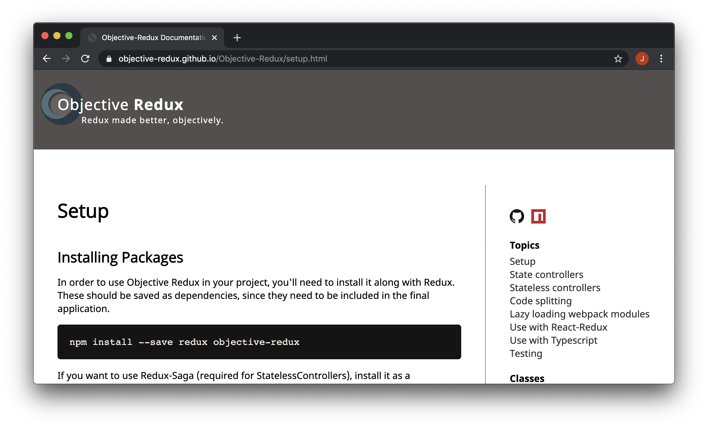

# Objective Redux
### Redux made better, objectively.

<a href="https://www.npmjs.com/package/objective-redux"></a>
<a href="./LICENSE"></a>
<a href="./dist"></a>
<br />
<a href="https://bundlephobia.com/result?p=objective-redux"></a>
<a href="https://github.com/Objective-Redux/Objective-Redux/actions"></a>

Make organizing and managing your Redux store easy.

<br />

<br />

# Meet your new Redux API

## Install

```
npm install --save redux redux-saga objective-redux
```

## Setup (for React)
```javascript
import React from 'react';
import ReactDOM from 'react-dom';
import { ObjectiveStoreProvider, ObjectiveStore } from 'objective-redux';
import App from './app';

export const store = new ObjectiveStore();

ReactDOM.render(
  <ObjectiveStoreProvider objectiveStore={objectiveStore}>
    <App />
  </ObjectiveStoreProvider>,
  document.getElementById('root')
);
```

## Example Slice
```javascript
import { StateController } from 'objective-redux';

const initialState = { isOn: false };

export class SwitchStateController extends StateController {
  constructor(store) {
    super(initialState, store);
  }

  static getName() {
    return 'switch';
  }

  setSwitch = this.registerAction(
    (state, isOn) => ({ isOn })
  );
}
```
```javascript
SwitchOneController.getInstance(store).setSwitch(true);
```

<br />

<br />

# Start using it now

You can read the <a href="https://objective-redux.github.io/Objective-Redux/">full documentation</a> for more detailed information, along with examples.

<a href="https://objective-redux.github.io/Objective-Redux/" alt="documentation website screenshot"></a>

In addition, you can take a look at the <a href="./examples">example apps</a> in the project's <a href="https://github.com/Objective-Redux/Objective-Redux/">GitHub repository</a>.

<br />

<br />

# Why use Objective-Redux?

<br />

## Keep your dependencies simple

### Lots of features, one small package

Objective-Redux replaces many of the packages you're already using.

For example, instead of React-Redux + Redux-Injectors + Redux-Toolkit

<a href="https://bundlephobia.com/result?p=react-redux"></a>
+
<a href="https://bundlephobia.com/result?p=redux-injectors"></a>
+
<a href="https://bundlephobia.com/result?p=redux-toolkit"></a>

you can simply use Objective-Redux

<a href="https://bundlephobia.com/result?p=objective-redux"></a>

_Bundle sizes vary based on how much of the package is unused and how effectively your bundler can remove the unused portions._

<br />

## Drop the boilerplate code

### Actions are a thing of the past&mdash; among other things

Object-Redux largely removes the need for action names, actions, switch-statement-reducers, selectors, and dispatching. You just need to write the mutating functions. Objective-Redux can take it from there.

```typescript
  // Define your mutation and forget about the rest.
  myAction = this.registerAction(
    (state, payload) => ({
      ...state,
      value: payload.value,
    })
  );
```

<br />

## Easy Debugging

### No more global searches for action names

Using Objective-Redux, your editor knows exactly where to find everything. That means you get intellisense, jump to definition, and more. Plus, your actions and reducer will never get out-of-sync.

<p style="text-align: center;">
  
</p>

<br />

## Powerful code splitting and lazy loading

### Get the pieces of state you need, when you need them

Stop wiring-up your reducers and sagas manually. And, for that matter, stop using large middleware package to help. Objective-Redux will take care of it for you, and it will do it on demand, dynamically, at runtime. Your store no longer needs to know about what's in it, leaving you free to move parts around as needed.

You can even use the pre-dispatch hook to load bundles when an action is fired. This allows you to fire actions that target controllers that haven't been downloaded, yet.

See the <a href="https://objective-redux.github.io/Objective-Redux/code-splitting.html">Code Splitting</a> topic in the documentation for more.


<br />

## Organize your state

### One slice, one object

Each controller class represents a slice, giving an intuitive way for developers to look at and conceptualize the state.

A slice of state never needs to know about what other slices are doing or how they're organized.


<br />

## Compatible with React-Redux

### Migrate over time
You can use Objective-Redux and React-Redux together. The ObjectiveStore is a decorated store object and can be used to `dispatch`, `subscribe`, `getState`, and even `replaceReducer`. Simply pass the ObjectiveStore to the React-Redux provider and use it normally.

See the <a href="https://objective-redux.github.io/Objective-Redux/use-with-react-redux.html">Use with React-Redux</a> topic in the documentation for more.

<br />

## Multiple ways to connect

### Inject properties or use hooks

You can connect your components to Objective-Redux to inject props from the store. Or, skip the connection process and use React hooks, instead.