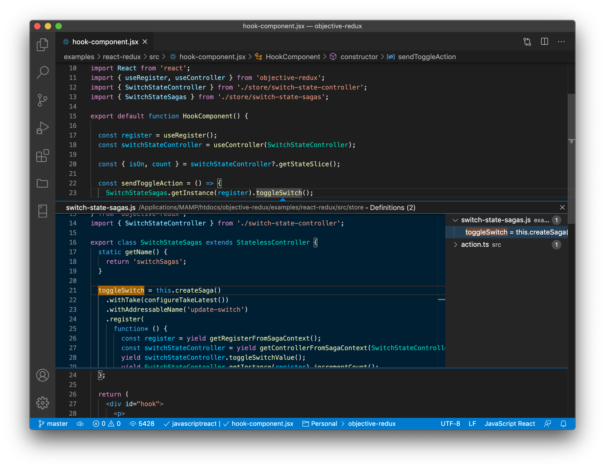
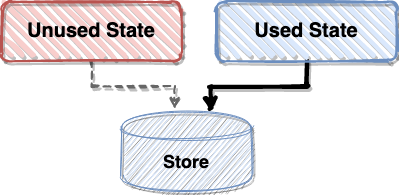

# Objective Redux
## Redux made better, objectively.
Object-oriented, light-weight, and TypeScript compatible.

<p>
  <a href="https://www.npmjs.com/package/objective-redux"></a>
  <a href="./LICENSE"></a>
  <a href="https://github.com/Objective-Redux/Objective-Redux/actions"></a>
</p>

<br />

<br />

# Meet your new Redux API

## Install

```
npm install --save redux redux-saga objective-redux
```

## Setup (for React)
```javascript
import React from 'react';
import ReactDOM from 'react-dom';
import { RegisterProvider, ReduxRegister } from 'objective-redux';
import App from './app';

export const register = new ReduxRegister();

ReactDOM.render(
  <RegisterProvider register={register}>
    <App />
  </RegisterProvider>,
  document.getElementById('root')
);
```

## Example Slice
```javascript
import { StateController } from 'objective-redux';

const initialState = { isOn: false };

export class SwitchStateController extends StateController {
  constructor(register) {
    super(initialState, register);
  }

  static getName() {
    return 'switch';
  }

  toggleSwitch = this.registerAction(
    (state) => ({ isOn: !state.isOn })
  );

  setSwitch = this.registerAction(
    (state, isOn) => ({ isOn })
  );
}
```
```javascript
SwitchOneController.getInstance(register).toggleSwitch();
```

<br />

<br />

# Start using it now

You can read the full documentation, along with examples, here:

https://objective-redux.github.io/Objective-Redux/

<br />

<br />

# Why use Objective-Redux?

<br />

## Drop the boilerplate code

### Actions are a thing of the past&mdash; among other things

Object-Redux largely removes the need for action names, actions, switch-statement-reducers, selectors, and dispatching. You just need to write the mutating function. Objective-Redux can take it from there.

```typescript
  // Define your mutation and forget about the rest.
  myAction = this.registerAction(
    (state, payload) => ({
      ...state,
      value: payload.value,
    })
  );
```

<br />

## Organize your state

### One slice, one object

Each controller class represents a slice, giving an intuitive way for developers to look at and conceptualize the state.

A slice of state never needs to know about what other slices are doing or how they're organized.

<br />

## Easy Debugging

### No more global searches for action names

Using Objective-Redux, your editor knows exactly where to find everything. That means you get intellisense, jump to definition, and more. Plus, your actions and reducer will never get out-of-sync.

<p style="text-align: center;">
  
</p>

<br />

## Code splitting and lazy loading

### Get the pieces of state you need, when you need them

Stop registering your reducers and sagas. Objective-Redux will take care of it for you, and it will do it on demand, dynamically, at runtime. Your store no longer needs to know about what's in it, leaving you free to move parts around as needed.



## Compatible with React-Redux

### Migrate over time
You can use Objective-Redux and React-Redux together. The ReduxRegister is a decorated store object and can be used to `dispatch`, `subscribe`, `getState`, and even `replaceReducer`&mdash;all without disrupting Objective-Redux controllers. Simply pass the ReduxRegister to the React-Redux provider and use it normally.

In your Objective-Redux based components, simply call `register.dispatch()` to fire off events to your non-Objective-Redux reducers. Use `withAddressableName()` when creating actions to receive them from outside of Objective-Redux.

<br />

## Multiple ways to connect

### Inject properties or use hooks

You can connect your components to Objective-Redux to inject props from the store. Or, skip the connection process and use React hooks, instead.